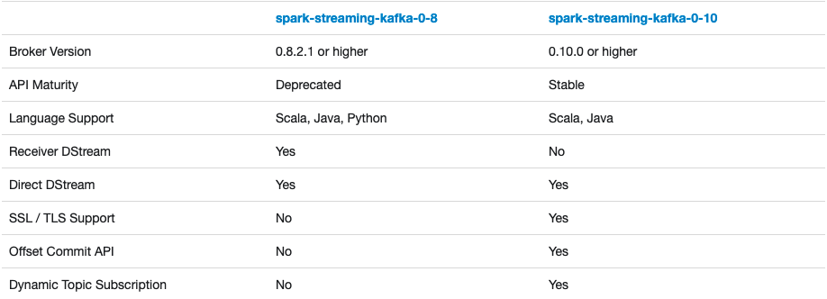
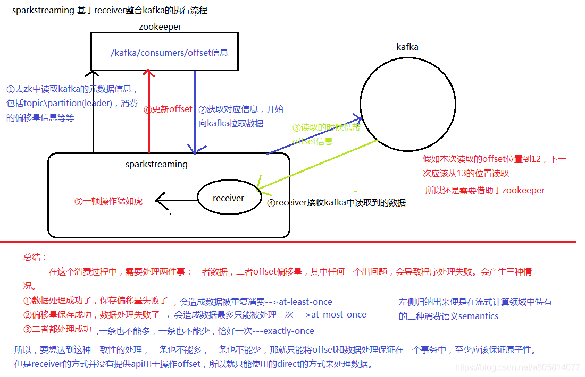

## Spark Streaming整合Kafka指南

### 简介
- kafka是做消息的缓存，数据和业务隔离操作的消息队列，而sparkstreaming是一款准实时流式计算框架，所以二者的整合，是大势所趋。二者的整合，有主要的两大版本。

- API地址：

    [streaming-kafka-0-8-integration](https://spark.apache.org/docs/2.4.5/streaming-kafka-0-8-integration.html)
    [streaming-kafka-0-10-integration](https://spark.apache.org/docs/2.4.5/streaming-kafka-0-10-integration.html)
    
    [streaming-kafka-integration](https://spark.apache.org/docs/2.4.5/streaming-kafka-integration.html)
    
    
    
- maven pom依赖

    ```xml
    <properties>
      <maven.compiler.source>8</maven.compiler.source>
      <maven.compiler.target>8</maven.compiler.target>
      <spark.version>2.4.5</spark.version>
      <scala.version>2.11</scala.version>
    </properties>
    
    <dependencies>
      <dependency>
        <groupId>org.scala-lang</groupId>
        <artifactId>scala-library</artifactId>
        <version>2.11.10</version>
      </dependency>
      <dependency>
        <groupId>org.apache.spark</groupId>
        <artifactId>spark-core_${scala.version}</artifactId>
        <version>${spark.version}</version>
      </dependency>
      <dependency>
        <groupId>org.apache.spark</groupId>
        <artifactId>spark-streaming_${scala.version}</artifactId>
        <version>${spark.version}</version>
      </dependency>
      <dependency>
        <groupId>org.apache.spark</groupId>
        <artifactId>spark-streaming-kafka-0-8_${scala.version}</artifactId>
        <version>${spark.version}</version>
      </dependency>
      <dependency>
        <groupId>org.apache.hbase</groupId>
        <artifactId>hbase-client</artifactId>
        <version>1.3.1</version>
      </dependency>
      <dependency>
        <groupId>mysql</groupId>
        <artifactId>mysql-connector-java</artifactId>
        <version>5.1.48</version>
      </dependency>
    </dependencies>
    ```
    
- 博客参考地址：`https://blog.csdn.net/a805814077/article/details/106531020`


### 一、Receiver方式

#### 1. kafka基于receiver方式一

- 这种方式使用Receiver来获取数据。Receiver是使用Kafka的高层次Consumer API来实现的。receiver从Kafka中获取的数据都是存储在Spark Executor的内存中的，然后Spark Streaming启动的job会去处理那些数据。
- 然而，在默认的配置下，这种方式可能会因为底层的失败而丢失数据。如果要启用高可靠机制，让数据零丢失，就必须启用Spark Streaming的预写日志机制（Write Ahead Log，`WAL`）。该机制会同步地将接收到的Kafka数据写入分布式文件系统（比如`HDFS`）上的预写日志中。所以，即使底层节点出现了失败，也可以使用预写日志中的数据进行恢复。
- 需要==**注意**==的地方
  - Kafka的topic分区和Spark Streaming中生成的RDD分区没有关系。 在KafkaUtils.createStream中增加分区数量只会增加单个receiver的线程数，不会增加Spark的并行度。
  - 可以创建多个的Kafka的输入DStream， 使用不同的group和topic， 使用多个receiver并行接收数据。
  - 如果启用了HDFS等有容错的存储系统，并且启用了写入日志，则接收到的数据已经被复制到日志中。因此，输入流的存储级别设置`StorageLevel.MEMORY_AND_DISK_SER`（即使用**`KafkaUtils.createStream(…，StorageLevel.MEMORY_AND_DISK_SER)`**）的存储级别。
  - 数据会丢失原因
- 架构图



- 具体操作

  1. 创建Kafka topic
  
  ```shell
  kafka-topics.sh --create --topic sparkstream08 --bootstrap-server hadoop101:9092,hadoop102:9092,hadoop103:9092 --partitions 3 --replication-factor 2
  ```
  
  2. 启动消费者
  
  ```shell
  kafka-console-producer.sh --topic sparkstream08 --broker-list hadoop101:9092,hadoop102:9092,hadoop103:9092
  ```
  
  3. <a href='./src/main/spark/com/summer/sparkstream/ReceiverModel.scala'>`ReceiverModel.scala`</a>

#### 2. kafka基于receiver方式二——使用checkpoint

### 二、Direct方式

Direct方式的特点：

- 简化的并行性：不需要创建多个输入Kafka流并将其合并。 使用directStream，Spark Streaming将创建与使用Kafka分区一样多的RDD分区，这些分区将全部从Kafka并行读取数据。 所以在Kafka和RDD分区之间有一对一的映射关系。
- 效率：在第一种方法中实现零数据丢失需要将数据存储在预写日志中，这会进一步复制数据。这实际
  上是效率低下的，因为数据被有效地复制了两次:一次是Kafka，另一次是由预先写入日志（Write
  Ahead Log）复制。这个第二种方法消除了这个问题，因为没有接收器，因此不需要预先写入日志。
  只要Kafka数据保留时间足够长。
- 正好一次（Exactly-once）的语义：第一种方法使用Kafka的高级API来在Zookeeper中存储消耗的偏移量。传统上这是从Kafka消费数据的方式。虽然这种方法（结合提前写入日志）可以确保零数据丢失（即至少一次语义），但是在某些失败情况下，有一些记录可能会消费两次。发生这种情况是因为Spark Streaming可靠接收到的数据与Zookeeper跟踪的偏移之间的不一致。因此，在第二种方法中，我们使用不使用Zookeeper的简单Kafka API。在其检查点内，Spark Streaming跟踪偏移量。这消除了Spark Streaming和Zookeeper/Kafka之间的不一致，因此Spark Streaming每次记录都会在发生故障的情况下有效地收到一次。为了实现输出结果的一次语义，将数据保存到外部数据存储区的输出操作必须是幂等的，或者是保存结果和偏移量的原子事务。

#### 1.kafka基于direct方式一
#### 2.kafka基于direct方式二——使用checkpoint
#### 3.kafka基于direct方式三——使用HBase管理offset

流程：

- 手动从hbase中读取上一次消费的offset信息
  - 有：从指定的offset位置开始消费
  - 无：从offset为0或者最小的位置开始消费
- 使用指定offset从kafka中拉取数据

- 拉取到数据之后进行业务处理

- 指定HBase进行offset的更新

- Table `hadoop-topic-offset`

| 字段        | 注释            |
| ----------- | --------------- |
| topic-group | 行键（Rowkey）  |
| cf          | 列族（Columns） |
| partition   | 分区            |
| offset      | 偏移量          |
| connection  | 连接            |

- 建表语句

```shell
create 'hadoop-topic-offset', 'cf'
```


### 三、Spark Streaming与Kafka整合的常见问题

#### 1.输出一致性语义的问题

- 幂等操作

  - 创建测试的mysql数据库

  ```sql
  create database kafka_offset_idempotent;
  use kafka_offset_idempotent;
  ```

  - 建表

  ```sql
  create table myorders(name varchar(20), orderid varchar(100) primary key);
  ```

  - 新建topic：`mytopic`

  ```shell
  kafka-topics.sh --bootstrap-server hadoop101:9092,hadoop102:9092,hadoop103:9092 --create --topic sparkstream --partitions 3 --replication-factor 1
  ```

  - 运行程序之后，向mytopic发送数据，数据格式为 “字符,数字” 比如 `abc,3`

  ```shell
  kafka-console-producer.sh --topic sparkstream --broker-list hadoop101:9092,hadoop102:9092,hadoop103:9092
  ```

  原子性操作

  ​	基于scala-jdbc的方式操作数据库

  - 创建测试的mysql数据库

  ```sql
  create database kafka_offset_transaction;
  use kafka_offset_transaction;
  ```

  - 建表

  ```sql
  create table mytopic(topic varchar(200), partid int, offset bigint);
  create table mydata(name varchar(200), id int);
  ```

  - 插入数据

  ```sql
  insert into mytopic(topic, partid, offset) values('mytopic',0,0);
  insert into mytopic(topic, partid, offset) values('mytopic',1,0);
  insert into mytopic(topic, partid, offset) values('mytopic',2,0);
  ```

  - 新建topic：`mytopic`

  ```shell
  kafka-topics.sh --bootstrap-server hadoop101:9092,hadoop102:9092,hadoop103:9092 --create --topic sparkstream --partitions 3 --replication-factor 1
  ```

  - 运行程序之后，向mytopic发送数据，数据格式为 “字符,数字” 比如 `abc,3`

  ```shell
  kafka-console-producer.sh --topic sparkstream --broker-list hadoop101:9092,hadoop102:9092,hadoop103:9092
  ```

#### 2.限流的处理

- 问题：sparkstreaming要从kafka拉取数据，并进行处理；下一次再循环，如果批次的间隔时间为2s，但是数据的处理时间为3s，所以会有越来越多的没有被处理的数据进行累积，最后会拖垮程序，这不是我们所期望的。

- 解决思路，只能限制流量。非常简单，通过一个参数搞定：spark.streaming.kafka.maxRatePerPartition

> spark.streaming.kafka.maxRatePerPartition: spark程序每秒中从每个partition分区读取的最大的数据条数。比如batchInterval为2s，topic的分区为3，该参数的值为100，请问，每个批次最多可以读取多少条数据？2×3×100=600条。

只用在DirectModel.scala的基础上改一个参数即可

```scala
val conf = new SparkConf()
      .setAppName("DirectLimit")
      //没有Receiver这里给一个就行
      .setMaster("local")
      //设置spark程序每秒中从每个partition分区读取的最大的数据条数
      .set("spark.streaming.kafka.maxRatePerPartition", "100")
```

